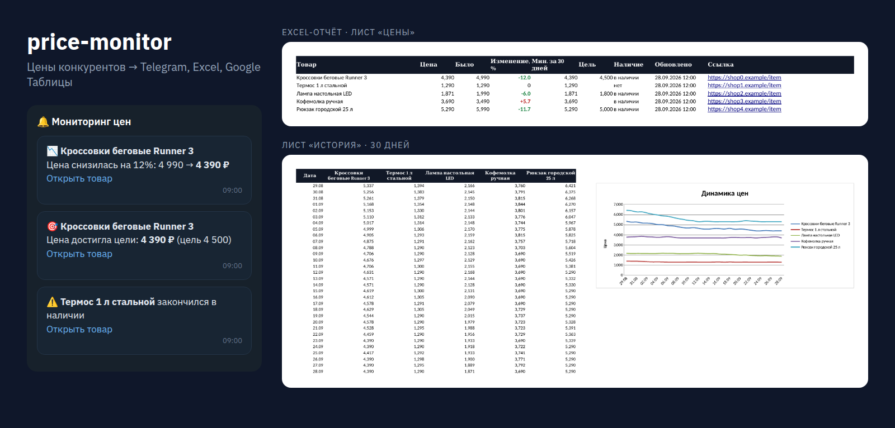

# price-monitor — мониторинг цен конкурентов

Следит за ценами и наличием товаров в интернет-магазинах. Присылает уведомления в Telegram и собирает отчёт в Excel с графиком за 30 дней. По желанию дублирует таблицу в Google Sheets.



## Что умеет

- **Сам находит цену на странице.** Порядок такой:
  1. микроразметка schema.org (JSON-LD);
  2. meta-теги и microdata;
  3. если разметки нет — CSS-селекторы, которые вы указываете для конкретного сайта.
- **Понимает любые форматы цен:** `1 299 ₽`, `1 870,50`, `12,345.50`, `от 990 руб.`.
- **Присылает уведомления в Telegram:**
  - цена упала на N % и больше;
  - цена достигла вашей цели;
  - товар появился в наличии или закончился.
- **Строит Excel-отчёт:**
  - лист «Цены»: текущая и прошлая цена, изменение в %, минимум за 30 дней, наличие, ссылка;
  - лист «История» с графиком;
  - отчёт уже настроен под печать на A4.
- **Выгружает в Google Таблицу** через официальный API с сервисным аккаунтом. Логин и пароль Google не нужны.
- **Бережно обращается с сайтами:**
  - пауза между запросами к одному сайту;
  - повторы с экспоненциальной задержкой при ошибках 429 и 5xx, учитывает `Retry-After`;
  - соблюдает `robots.txt`.
- **Хранит историю** в SQLite: без отдельного сервера базы данных.

## Быстрый старт

Нужен Python 3.10+.

```bash
git clone https://github.com/nkd077/price-monitor.git
cd price-monitor
python3 -m venv .venv && source .venv/bin/activate   # Windows: .venv\Scripts\activate
pip install -r requirements.txt

cp .env.example .env                    # настройки и токены
cp products.example.json products.json  # список товаров
python -m price_monitor check           # одна проверка + отчёт reports/prices.xlsx
```

Проверка по расписанию, например раз в 30 минут:

```bash
python -m price_monitor watch --every 30
```

## Настройка

### Товары — `products.json`

```json
{
  "products": [
    { "name": "Кроссовки Runner 3", "url": "https://shop.ru/runner-3", "target_price": 4500 },
    { "name": "Лампа LED", "url": "https://lamps.ru/lamp",
      "selectors": { "price": ".price__current", "in_stock": ".buy-button" } }
  ]
}
```

- `target_price` — необязательно. Когда цена опустится до этого значения, придёт уведомление.
- `selectors` — нужны только для сайтов без микроразметки:
  - `price` — элемент с ценой;
  - `in_stock` — элемент, который есть на странице, только когда товар в наличии (например, кнопка «Купить»).

### Секреты и параметры — `.env`

| Параметр | Зачем |
|---|---|
| `TELEGRAM_BOT_TOKEN`, `TELEGRAM_CHAT_ID` | Куда слать уведомления. Токен выдаёт @BotFather, свой ID можно узнать у @userinfobot |
| `DROP_ALERT_PERCENT` | Порог снижения цены для уведомления (по умолчанию 5 %) |
| `GOOGLE_SHEET_ID`, `GOOGLE_CREDENTIALS_FILE` | Выгрузка в Google Таблицу (см. ниже) |
| `PER_HOST_DELAY`, `MAX_RETRIES`, `CONCURRENCY` | Скорость и бережность загрузки |

Файл `.env` добавлен в `.gitignore`: токены не попадут в репозиторий.

### Google Таблица (необязательно)

1. В [Google Cloud Console](https://console.cloud.google.com/) создайте проект и включите **Google Sheets API**.
2. Создайте **сервисный аккаунт** и скачайте JSON-ключ. Положите его рядом с проектом.
3. Откройте свою таблицу и выдайте e-mail сервисного аккаунта (`...@...iam.gserviceaccount.com`) права редактора.
4. Заполните в `.env`:
   - `GOOGLE_SHEET_ID` — ID из адреса таблицы;
   - `GOOGLE_CREDENTIALS_FILE` — путь к ключу.

## Запуск в Docker

```bash
docker build -t price-monitor .
docker run -d --name price-monitor --restart unless-stopped \
  --env-file .env \
  -v "$PWD/products.json:/app/products.json:ro" \
  -v "$PWD/data:/app/data" -v "$PWD/reports:/app/reports" \
  price-monitor
```

## Тесты

```bash
python -m unittest discover -s tests -t .
```

14 тестов, все без реальной сети (используется `httpx.MockTransport`). Что проверяется:

- разбор цен в разных форматах;
- три способа извлечения цены (JSON-LD, microdata, CSS);
- повторы запросов и соблюдение robots.txt;
- правила уведомлений;
- полный цикл: две проверки, снижение цены, уведомление, Excel;
- авторизация и запись в Google Sheets API.

## Структура

```
price_monitor/
  config.py    настройки из .env и products.json
  fetcher.py   загрузка страниц: повторы, паузы, robots.txt, ротация User-Agent
  extract.py   извлечение цены, названия и наличия
  storage.py   история цен в SQLite
  alerts.py    правила уведомлений и отправка в Telegram
  export.py    Excel-отчёт с графиком и Google Sheets API
  monitor.py   один цикл проверки
tests/         тесты и HTML-фикстуры магазинов
```

## Этика

Инструмент рассчитан на публичные страницы товаров:

- соблюдает robots.txt и держит паузы между запросами;
- не обходит капчи и защиту от ботов;
- не собирает персональные данные.

Если сайт запрещает автоматический сбор, используйте его официальный API или выгрузку.

---

Нужна доработка под ваши магазины (маркетплейсы, выгрузка в 1С или CRM)? Пишите в Telegram: [@nkdo77](https://t.me/nkdo77).

Лицензия: MIT.
